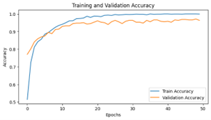

# Brain Tumour Classification using Convolutional Neural Networks

## Overview
This project explores the application of deep learning techniques, specifically Convolutional Neural Networks (CNNs), to classify brain tumors from MRI images. The project aimed to evaluate the performance of various CNN architectures and determine which network performs best in classifying four types of brain tumors: glioma, meningioma, pituitary tumors, and no tumor.

## Dataset
The dataset used consisted of 480 MRI images, 120 for each of the categorized four classes: glioma, meningioma, pituitary tumor, and no tumor. Data augmentation techniques were applied to expand the dataset, resulting in 1920 images for training and evaluation.


## CNN Architecture Explored
- VGG16: A relatively simple and widely-used CNN known for its use of small 3x3 convolution filters. It achieved an accuracy of 96.1%.


- InceptionV3: A more complex architecture that uses factorized convolutions to reduce computational cost while maintaining high accuracy. It achieved an accuracy of 95.3%.
  

- ResNet50: A deep CNN that addresses the vanishing gradient problem using residual connections. It achieved an accuracy of 96.7%.
  

- EfficientNetB1: A CNN that uses compound scaling to balance depth, width, and resolution, achieving a high accuracy of 99.48%.
  

- DenseNet121: A densely connected CNN that improves gradient flow and feature reuse, achieving an accuracy of 97.1%.
  


## Key Findings
- EfficientNetB1 emerged as the top performer, achieving the highest accuracy (99.48%) and demonstrating excellent generalization capabilities.
- ResNet50 and DenseNet121 also performed well, particularly in handling complex feature extraction, though they required more computational resources.
- VGG16 and InceptionV3 provided strong performance with relatively lower computational demands, making them suitable for less resource-intensive environments.

## Conclusion
The study identified EfficientNetB1 as the optimal CNN architecture for brain tumor classification in this context, balancing high accuracy with computational efficiency. The results underscore the potential of deep learning in medical imaging, particularly in enhancing diagnostic accuracy and patient outcomes.

## Future Work
- Explore the impact of using larger and more diverse datasets.
- Further fine-tune the hyperparameters of the networks to minimize overfitting.
- Investigate the application of these models in real-time clinical environments where computational resources may be limited.

## Special Thanks to
- Matthew Chuang
- Chan Xue Li
- Ayan Priyadarshi
- Ahmad Fairuzi

## Setting up Project
- Prior to running data_prepreprocessing.ipynb, create folder "prepared_data". Augmented data will be stored and automatically ignored there. 
- For model checkpoints, store them within folder model_checkpoints. Model checkpoints will be stored and automatically ignored there. 
- For model tuning, stored them within folder "kt_tuning". Tuning files will be stored and automatically ignored there. 

## Setting up Python Virtual Environment
Dependencies will be handled through Python's virtualenv. 
```
virtualenv dependencies
```
When using dependencies from IPYNB notebooks in VSCode, click Ctr P, the select Python interpreter as dependencies

Activate the virtual environment from the Terminal
```
./dependencies/Scripts/activate
```
To deactivate the virtual environment
```
deactivate
```
